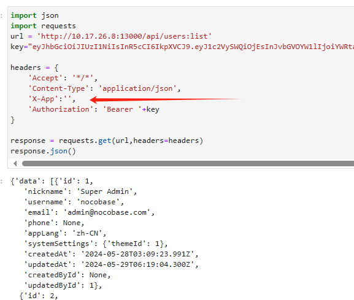

# nocobase
https://cn.nocobase.com/

## jwt
delete from "tokenBlacklist" where token in ( select token from "apiKeys" );

## /app/nocobase/node_modules/@nocobase/app/dist/client/global.css
span[data-testid="help-button"] { display:none; }

